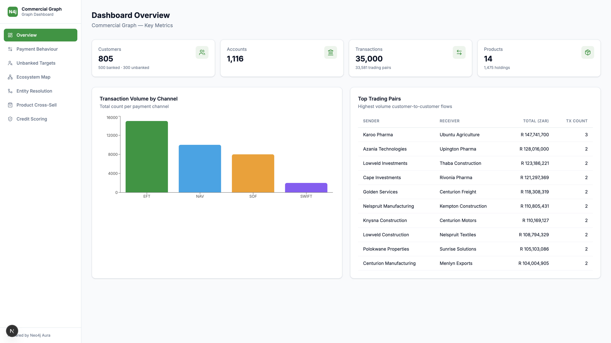
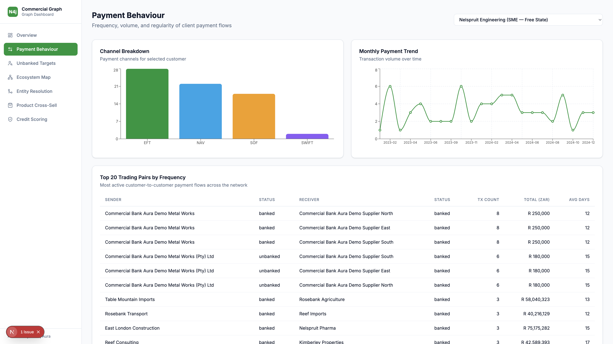
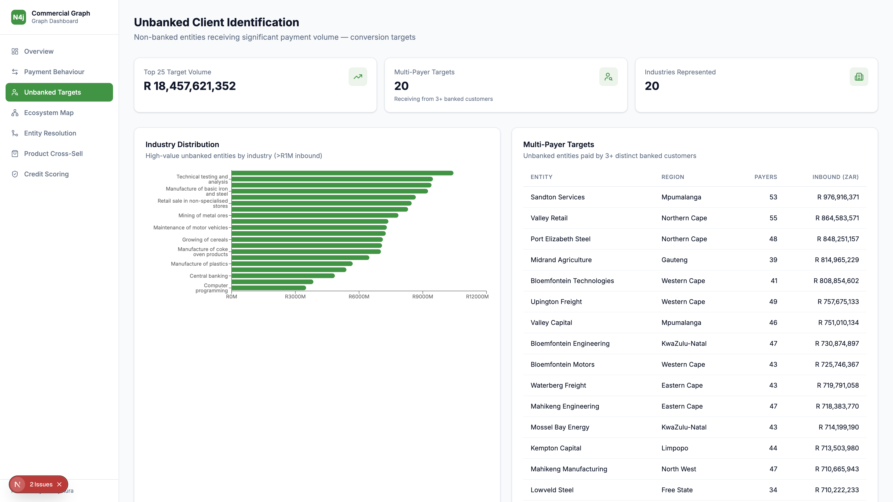
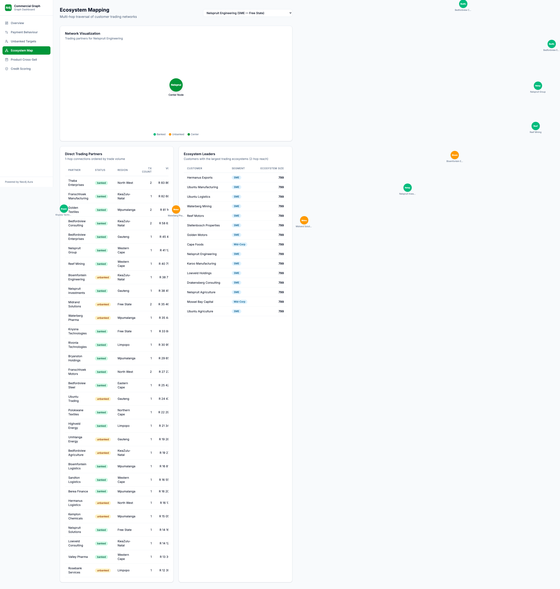
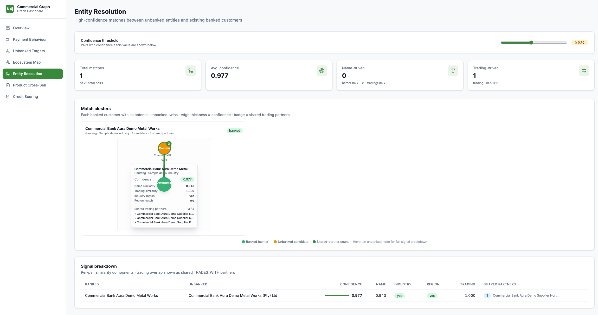
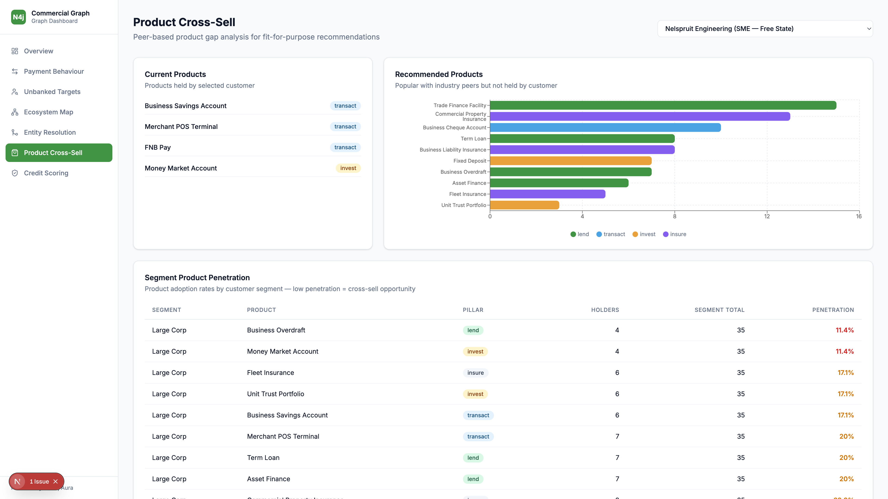
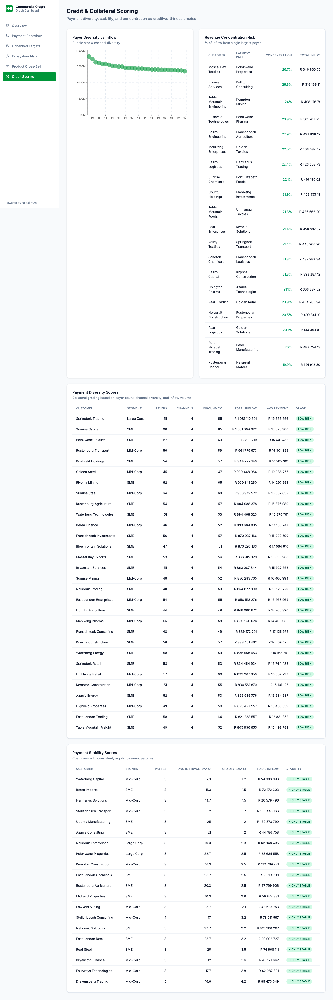

# Commercial Graph Dashboard

A Next.js dashboard powered by **Neo4j Aura** that visualises commercial banking graph data — customer networks, payment flows, unbanked conversion targets, ecosystem mapping, product cross-sell opportunities, and credit scoring.

**Live demo**: [commercial-graph-dashboard.vercel.app](https://commercial-graph-dashboard.vercel.app)

---

## Screenshots

### Overview
Key metrics at a glance: customer counts, transaction volumes, channel breakdown, and top trading pairs.



### Payment Behaviour
Frequency, volume, and regularity of client payment flows with channel breakdown and monthly trends.



### Unbanked Client Identification
Non-banked entities receiving significant payment volume — ranked conversion targets with industry distribution.



### Ecosystem Mapping
Multi-hop traversal of customer trading networks with direct partner tables and ecosystem leader rankings.



### Entity Resolution
High-confidence matches between unbanked entities and existing banked customers




### Product Cross-Sell
Peer-based product gap analysis for fit-for-purpose recommendations, with segment penetration rates.



### Credit & Collateral Scoring
Payment diversity, stability, and concentration as creditworthiness proxies — graph-derived scoring.



---

## Tech Stack

| Layer | Technology |
|-------|-----------|
| Frontend | Next.js 16, React 19, Tailwind CSS 4, Recharts |
| Backend | Next.js API Routes (server-side Neo4j queries) |
| Database | Neo4j Aura (cloud graph database) |
| Deployment | Vercel |

## Getting Started

### Prerequisites

- Node.js 20+
- A Neo4j Aura instance with the Commercial Graph data loaded

### Setup

```bash
git clone https://github.com/mbabari/commercial-bank-graph-dashboard.git
cd commercial-bank-graph-dashboard
npm install
```

Create a `.env.local` file:

```env
NEO4J_URI=neo4j+s://<your-aura-instance>.databases.neo4j.io
NEO4J_USERNAME=neo4j
NEO4J_PASSWORD=<your-password>
NEO4J_DATABASE=neo4j
```

### Run

```bash
npm run dev
```

Open [http://localhost:3000](http://localhost:3000).

## Project Structure

```
src/
├── app/
│   ├── api/                  # Server-side API routes (Neo4j queries)
│   │   ├── overview/
│   │   ├── payment-behaviour/
│   │   ├── unbanked/
│   │   ├── ecosystem/
│   │   ├── entity-resolution/
│   │   ├── cross-sell/
│   │   └── credit-scoring/
│   ├── payment-behaviour/    # Client pages
│   ├── unbanked/
│   ├── ecosystem/
│   ├── entity-resolution/
│   ├── cross-sell/
│   ├── credit-scoring/
│   ├── layout.tsx
│   └── page.tsx              # Overview page
├── components/               # Reusable UI components
│   ├── Badge.tsx
│   ├── Card.tsx
│   ├── DataTable.tsx
│   ├── Loading.tsx
│   ├── MetricCard.tsx
│   └── Sidebar.tsx
└── lib/
    ├── neo4j.ts              # Neo4j driver & query utility
    └── utils.ts              # Formatting helpers
```

## Related

- [Commercial Graph Demo](https://github.com/mbabari/commercial-bank-graph-demo) — Cypher scripts, data model, synthetic data generation, GDS algorithms, and entity resolution
